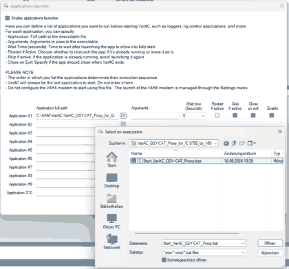
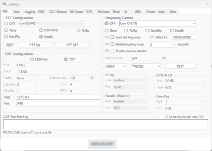

# VarAC QSY-CAT Proxy for IC-9700 by HBØTR V5.00

A small Windows CAT/PTT proxy for **VarAC + VARA SAT + Icom IC-9700** in a QO-100 transverter setup with **433 MHz receive IF** and **144 MHz transmit IF**.

**Author:** HBØTR Stefan Franz  
**QRZ:** https://www.qrz.com/db/HB0TR  
**Version:** V5.00

> This is an independent amateur-radio project. It is not affiliated with or endorsed by VarAC, Icom, Kuhne electronic, or the VARA software author.

## What problem does it solve?

In this QO-100 setup, VarAC controls one CAT frequency, while the proxy keeps two coordinated IC-9700 VFO frequencies:

> **Important:** Keep the IC-9700 in **normal VFO mode**. **Do not enable SATELLITE mode.** The proxy itself selects MAIN and SUB and sets the corresponding RX and TX IF frequencies.

- **RX / MAIN:** 433 MHz IF
- **TX / SUB:** 144 MHz IF

The proxy accepts VarAC CAT commands over TCP, sets the IC-9700 RX and TX IFs separately via CI-V, and exposes a second local Hamlib-compatible TCP endpoint for PTT.

### Data flow

```text
VarAC frequency control
  CAT / Icom IC-9700
  TCP 127.0.0.1:9701
          |
          v
+-------------------------------------------+
| VarAC QSY-CAT Proxy V5.00                 |
|                                           |
| CAT/QSY:  TCP 9701                        |
| PTT:      Hamlib-compatible TCP 4532      |
|                                           |
| RX/MAIN 433 MHz  -> IC-9700 via CI-V      |
| TX/SUB  144 MHz  -> IC-9700 via CI-V      |
+-------------------------------------------+
          |
          v
       COM5 / 115200 / CI-V A2h
          |
          v
       Icom IC-9700

VarAC PTT
  Hamlib localhost:4532
          |
          +--------------------> Proxy
```

## Tested station configuration

The V5.00 mapping is built for the station configuration used by HBØTR:

| Function | IF at IC-9700 | Converter mapping |
|---|---:|---|
| QO-100 downlink RX | 433.595 MHz | Kuhne LNC, 10,056 MHz LO -> 10,489.595 MHz RF |
| QO-100 uplink TX | 144.095 MHz | Kuhne upconverter, 2,256 MHz LO -> 2,400.095 MHz RF |

The proxy keeps a fixed **RX/TX IF delta of 289.500 MHz**:

```text
TX IF = RX IF - 289.500 MHz

433.595 MHz RX  -> 144.095 MHz TX
433.597550 MHz  -> 144.097550 MHz
```

## Requirements

- Windows 10 or Windows 11
- VarAC with VARA SAT
- Icom IC-9700 connected by USB and visible as a Windows COM port
- IC-9700 CI-V address `A2h`
- Working QO-100 converter chain using 433 MHz RX IF and 144 MHz TX IF
- A free local TCP port `9701` for CAT/QSY
- A free local TCP port `4532` for PTT

No virtual COM-port pair is required.

## Quick start

1. Download or clone this repository.
2. Edit `proxy_config.ini` if your IC-9700 is not on `COM5`.
3. Keep the IC-9700 in **normal VFO mode** — **SATELLITE mode must be OFF** — and set **USB-D** manually.
4. Start `Start_VarAC_QSY-CAT_Proxy.bat`.
5. Configure VarAC exactly as shown below.
6. For the first transmit test, use minimum safe drive power and verify the complete converter chain before normal operation.

## Application Launcher / VARA

For QO-100 operation, use **VARA SAT** as the modem application in the VarAC application launcher.

**Important launcher setting:**

```text
Modem / application: VARA SAT
```

<a href="docs/images/application-launcher.png"></a>

*Click the screenshot to open the image directly.*

The screenshot shows the proxy batch file added to the VarAC Application Launcher. The exact local path will depend on where you extracted or cloned the project.

## VarAC: Settings -> RIG Control and VARA Configurations -> RIG

The text below is authoritative and is included in addition to the UI screenshot so the setup remains readable if VarAC changes its layout.

### Frequency control

```text
Frequency control: CAT
Rig:               Icom IC-9700
CAT connection:    TCP
Host:              127.0.0.1
Port:              9701
Mode:              USB-D
Diff Hz:            -10056000000
Read frequency:    OFF initially
```

The `Diff Hz` value converts the QO-100 downlink frequency used by VarAC to the 433 MHz receive IF presented to the IC-9700:

```text
10,489.595 MHz - 10,056.000 MHz = 433.595 MHz
```

### PTT control

```text
PTT configuration: Hamlib
Host:              localhost
Port:              4532
```

The proxy accepts the Hamlib-style `T 1` / `T 0` commands used for PTT and translates them to IC-9700 CI-V PTT commands.

<a href="docs/images/varac-rig-control.png"></a>

*Click the screenshot to open the image directly.*

The screenshot shows the working VarAC RIG configuration used with this proxy. The text settings above are the authoritative values.

## IC-9700 settings

Known-working station values:

```text
Operating mode:        VFO mode
SATELLITE mode:        OFF
RX / MAIN:             433.595 MHz USB-D
TX / SUB:              144.095 MHz USB-D
CI-V address:          A2h
USB CI-V baud rate:    115200
```

The proxy opens the selected serial port with:

```text
Data:      8N1
Handshake: none
DTR:       HIGH
RTS:       HIGH
```

## Proxy configuration

Default `proxy_config.ini`:

```ini
LISTEN_HOST=127.0.0.1
LISTEN_PORT=9701
HAMLIB_HOST=127.0.0.1
HAMLIB_PORT=4532
RADIO_PORT=COM5
BAUD=115200
CIV_ADDRESS=A2
RX_TX_DELTA_HZ=289500000
RX_IF_MIN_HZ=433000000
RX_IF_MAX_HZ=434000000
TX_IF_MIN_HZ=144000000
TX_IF_MAX_HZ=146000000
IGNORE_VARAC_MODE_COMMANDS=1
LOG_FILE=QSY-CAT_Proxy.log
```

### Why mode commands are intercepted

By default, `IGNORE_VARAC_MODE_COMMANDS=1`. During development, direct forwarding of the VarAC Icom mode command caused unwanted transmit behavior. V5.00 therefore acknowledges that mode command to VarAC but leaves the radio mode unchanged. Keep the IC-9700 in **VFO mode with SATELLITE mode OFF**, and set **USB-D manually** before operation.

## Expected log output

A successful QSY looks similar to:

```text
1/5 select MAIN (07 D0) ... OK (FB)
2/5 set RX frequency on MAIN (05) ... OK (FB)
3/5 select SUB (07 D1) ... OK (FB)
4/5 set TX frequency on SUB (05) ... OK (FB)
5/5 select MAIN again (07 D0) ... OK (FB)
FREQ: RX/MAIN 433.595000 MHz | TX/SUB 144.095000 MHz
```

A successful PTT cycle looks similar to:

```text
HAMLIB RX: T 1
PTT 1/2 select SUB/TX (07 D1) ... OK (FB)
PTT 2/2 TX ON (1C 00 01) ... OK (FB)
PTT = TX

HAMLIB RX: T 0
PTT 1/2 TX OFF (1C 00 00) ... OK (FB)
PTT 2/2 select MAIN/RX (07 D0) ... OK (FB)
PTT = RX
```

## Safety

The proxy controls real radio hardware and can key the transmitter. Before the first transmit test:

- reduce IC-9700 drive power to a safe level for the upconverter;
- verify that the correct 144 MHz TX path is selected;
- verify the upconverter input-power specification;
- use a dummy load / suitable test arrangement where appropriate;
- confirm that PTT returns to RX correctly before unattended use.

For the Kuhne MKU UP 2424 B, the manufacturer specifies an adjustable IF input-power range of **0.5 to 5 W**. Always follow the documentation for your exact hardware revision.

## Troubleshooting

See [docs/TROUBLESHOOTING.md](docs/TROUBLESHOOTING.md).

The proxy writes `QSY-CAT_Proxy.log` next to the script. This file is intentionally ignored by Git.

## Project files

```text
.
├── VarAC_QSY-CAT_Proxy_IC-9700_HB0TR.ps1   # proxy implementation
├── Start_VarAC_QSY-CAT_Proxy.bat            # Windows launcher
├── proxy_config.ini                          # runtime configuration
├── README.md
├── CHANGELOG.md
├── LICENSE
├── NOTICE
├── CITATION.cff
├── CONTRIBUTING.md
├── SECURITY.md
├── docs/
│   ├── ARCHITECTURE.md
│   ├── TROUBLESHOOTING.md
│   ├── LICENSE-OPTIONS.md
│   └── images/
└── .github/
```

## License

The prepared GitHub version uses the **MIT License** as the recommended default. It is intentionally permissive and makes it easy for other amateur-radio operators to use, modify, and redistribute the proxy while retaining the copyright/license notice.

If you prefer stronger reciprocity or an explicit patent grant, read [docs/LICENSE-OPTIONS.md](docs/LICENSE-OPTIONS.md) **before publishing** and replace `LICENSE` if necessary.

## Author

**HBØTR Stefan Franz**  
https://www.qrz.com/db/HB0TR

If you use or adapt the project, attribution is appreciated. `NOTICE` and `CITATION.cff` are included to make that easy.

## References

- VarAC: https://www.varac-hamradio.com/
- VarAC CAT customization guide: https://www.varac-hamradio.com/post/rig-control-cat-command-file-cat-customization-guide
- Icom IC-9700 CI-V Reference Guide download page: https://www.icomjapan.com/support/manual/2161/
- Icom IC-9700 product page: https://www.icomjapan.com/lineup/products/IC-9700/
- Kuhne MKU UP 2424 B: https://shop.kuhne-electronic.de/funk/en/shop/leistungsverstaerker/prof-heat-sinks/MKU%2BUP%2B2424%2BB%2BOscar%2BPhase%2B4%2BUp-Converter/?card=1880
- Kuhne MKU LNC 10 QO-100: https://shop.kuhne-electronic.de/funk/en/shop/leistungsverstaerker/prof-heat-sinks/MKU%2BLNC%2B10%2BQO-100/?card=1875

## Disclaimer

Amateur-radio operation is subject to your local regulations and station licence. You are responsible for RF safety, frequency accuracy, drive levels, occupied bandwidth, and lawful operation. This software is supplied without warranty; test it carefully with your own station before relying on it.
