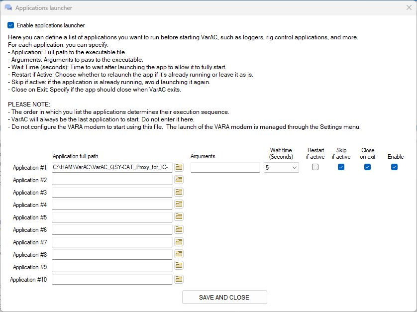
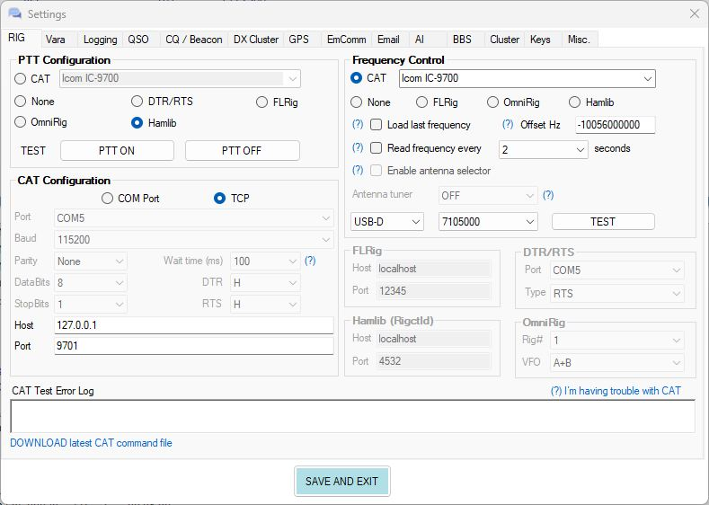

# VarAC QSY-CAT Proxy for IC-9700 by HBØTR V5.01

A Windows CAT/PTT proxy for **VarAC + VARA SAT + Icom IC-9700** in a QO-100 transverter setup. V5.01 uses the IC-9700's **native SATELLITE mode and full-duplex operation**, so the QO-100 downlink remains available while transmitting.

**Author:** HBØTR Stefan Franz  
**QRZ:** https://www.qrz.com/db/HB0TR  
**Version:** V5.01

> This is an independent amateur-radio project. It is not affiliated with or endorsed by VarAC, Icom, Kuhne electronic, or the VARA software author.

## What's new in V5.01

V5.01 changes the radio architecture from the normal-VFO approach used by V5.00 to the IC-9700's native SATELLITE mode.

The tested SAT mapping is:

| SAT side | Function | IC-9700 IF | QO-100 station mapping |
|---|---|---:|---|
| `D0` | Downlink / RX | 433.595 MHz | 10,489.595 MHz RF with 10,056.000 MHz RX LO |
| `D1` | Uplink / TX | 144.095 MHz | 2,400.095 MHz RF with 2,256.000 MHz TX LO |

During PTT, the IC-9700 transmits on the 144 MHz uplink side while the 433 MHz downlink side remains active for receive. No MAIN/SUB exchange or VFO-A workaround is used.

## Data flow

```text
VarAC QO-100 downlink frequency
        |
        | Diff Hz = -10056000000
        v
433 MHz RX IF presented to CAT
        |
        v
+------------------------------------------------+
| VarAC QSY-CAT Proxy V5.01                     |
|                                                |
| CAT/QSY: TCP 127.0.0.1:9701                   |
| PTT:     Hamlib-compatible TCP 127.0.0.1:4532 |
|                                                |
| SAT D0 / RX = requested 433 MHz IF             |
| SAT D1 / TX = D0 - 289.500 MHz                 |
| PTT = native CI-V 1C 00 01 / 1C 00 00         |
+------------------------------------------------+
        |
        v
COM5 / 115200 / CI-V A2h
        |
        v
Icom IC-9700 in SATELLITE mode
        |
        +--> D0: 433 MHz downlink receive
        |
        +--> D1: 144 MHz uplink transmit
             while D0 remains active
```

## Tested full-duplex behavior

The V5.01 design was validated on the HBØTR IC-9700 station with these behaviors:

- `16 5A 01` enables native SATELLITE mode.
- `07 D0` addresses the 433 MHz downlink/RX SAT side.
- `07 D1` addresses the 144 MHz uplink/TX SAT side.
- Both SAT sides can be set to USB-D with:
  - `06 01 01` — USB
  - `1A 06 01 02` — DATA ON / filter 2
- CI-V command `05` sets the D0 and D1 frequencies independently.
- PTT uses only `1C 00 01` / `1C 00 00`.
- During TX on 144 MHz, the 433 MHz downlink remained active and the own QO-100 downlink was audible.

## Requirements

- Windows 10 or Windows 11
- VarAC with VARA SAT
- Icom IC-9700 connected by USB and visible as a Windows COM port
- IC-9700 CI-V address `A2h`
- USB CI-V at 115200 baud
- QO-100 converter chain using approximately 433 MHz RX IF and 144 MHz TX IF
- Local TCP port `9701` for CAT/QSY
- Local TCP port `4532` for Hamlib-compatible PTT

No virtual COM-port pair is required.

## Quick start

1. Download or clone the repository.
2. Edit `proxy_config.ini` if the IC-9700 is not on `COM5`.
3. Review the converter values and `QO100_DL_RF_HZ` in `proxy_config.ini`.
4. Start `Start_VarAC_QSY-CAT_Proxy.bat`.
5. The proxy opens the radio, enables SATELLITE mode if needed, initializes both SAT sides to USB-D, optionally applies the configured startup frequencies, and verifies the resulting state.
6. Only after successful initialization are CAT port `9701` and PTT port `4532` opened.
7. Start VarAC / VARA SAT.
8. For the first transmit test, use minimum safe drive power and verify the complete converter chain.

## VarAC configuration

### Application Launcher

Use **VARA SAT** as the modem application.

<a href="docs/images/application-launcher.jpg"></a>

### Frequency control

```text
Frequency control: CAT
Rig:               Icom IC-9700
CAT connection:    TCP
Host:              127.0.0.1
Port:              9701
Mode:              USB-D
Diff Hz:            -10056000000
Read frequency:    OFF initially
```

The VarAC `Diff Hz` converts QO-100 downlink RF to the IC-9700 RX IF:

```text
10,489.595 MHz - 10,056.000 MHz = 433.595 MHz
```

`QO100_DL_RF_HZ` in `proxy_config.ini` is a separate setting: it defines the **startup QO-100 downlink frequency** used by the proxy before VarAC connects.

### PTT control

```text
PTT configuration: Hamlib
Host:              localhost
Port:              4532
```

The proxy accepts the Hamlib-style `T 1` / `T 0` PTT commands.

<a href="docs/images/varac-rig-control.jpg"></a>

## IC-9700 operation in V5.01

V5.01 is designed for **native SATELLITE mode**.

```text
SATELLITE mode:        ON
D0 / Downlink / RX:    433 MHz IF, USB-D
D1 / Uplink / TX:      144 MHz IF, USB-D
CI-V address:          A2h
USB CI-V baud rate:    115200
```

The proxy initializes SATELLITE mode and USB-D automatically. It opens the serial port with:

```text
Data:      8N1
Handshake: none
DTR:       HIGH
RTS:       HIGH
```

## Proxy configuration

Default `proxy_config.ini`:

```ini
LISTEN_HOST=127.0.0.1
LISTEN_PORT=9701

HAMLIB_HOST=127.0.0.1
HAMLIB_PORT=4532

RADIO_PORT=COM5
BAUD=115200
CIV_ADDRESS=A2

RX_TX_DELTA_HZ=289500000

STARTUP_SET_FREQUENCIES=1
QO100_DL_RF_HZ=10489595000
RX_CONVERTER_LO_HZ=10056000000

RX_IF_MIN_HZ=433000000
RX_IF_MAX_HZ=434000000
TX_IF_MIN_HZ=144000000
TX_IF_MAX_HZ=146000000

IGNORE_VARAC_MODE_COMMANDS=1
LOG_FILE=QSY-CAT_Proxy.log
```

### Startup frequency calculation

When:

```ini
STARTUP_SET_FREQUENCIES=1
```

the proxy calculates:

```text
D0/RX IF = QO100_DL_RF_HZ - RX_CONVERTER_LO_HZ
D1/TX IF = D0/RX IF - RX_TX_DELTA_HZ
```

With the defaults:

```text
QO100_DL_RF_HZ      = 10,489.595 MHz
RX_CONVERTER_LO_HZ  = 10,056.000 MHz
D0/RX IF             =    433.595 MHz
RX_TX_DELTA_HZ       =    289.500 MHz
D1/TX IF             =    144.095 MHz
```

The RF value is stored as **integer Hz** (`10489595000`) to avoid decimal-separator ambiguity.

Set:

```ini
STARTUP_SET_FREQUENCIES=0
```

to retain the IC-9700's existing SAT frequencies at startup. Safety-window and USB-D checks still apply.

The helper `tools/Test_QO100_Startup_Frequency_Config_HB0TR.ps1` validates the INI calculation without opening the COM port or changing the radio.

## QSY sequence

For each VarAC QSY inside the configured 433 MHz RX window, V5.01 performs:

```text
07 D0       select SAT D0/RX
05 ...      set requested RX IF
07 D1       select SAT D1/TX
05 ...      set RX IF - 289.500 MHz
07 D0       return selection to D0/RX
```

The D0 and D1 frequency writes were tested independently in SATELLITE mode; setting one side did not move the other side.

## PTT sequence

Native SAT full-duplex PTT is intentionally simple:

```text
PTT ON:   1C 00 01
PTT OFF:  1C 00 00
```

No `07 D0/D1` selection and no `07 B0` XCHG are used for PTT.

## USB-D initialization and VarAC mode commands

V5.01 initializes both SAT sides to USB-D using the tested classic CI-V sequence:

```text
06 01 01
1A 06 01 02
```

The proxy then verifies USB and DATA ON by readback.

Keep:

```ini
IGNORE_VARAC_MODE_COMMANDS=1
```

VarAC Icom mode command `0x26` is acknowledged locally rather than forwarded to the radio. This keeps the verified USB-D state intact and avoids relying on `0x26` in IC-9700 SATELLITE mode.

## Startup safety / fail-closed behavior

Before opening CAT/PTT listeners, V5.01 verifies:

- SATELLITE mode is ON;
- D0/RX is USB-D;
- D1/TX is USB-D;
- D0/RX lies inside the configured RX IF safety window;
- D1/TX lies inside the configured TX IF safety window;
- when startup frequency setting is enabled, the requested values read back exactly;
- D0/RX is checked again after D1/TX is written.

If initialization fails, CAT/PTT listeners are not started.

## Expected log output

A successful startup with the default QO-100 frequency includes lines similar to:

```text
INIT OK: SATELLITE = ON
INIT START FREQUENCIES: ON | D0/RX 433.595000 MHz | D1/TX 144.095000 MHz
INIT OK: D0/RX = USB-D
INIT OK: D0/RX = 433.595000 MHz
INIT OK: D1/TX = USB-D
INIT OK: D1/TX = 144.095000 MHz
RADIO INIT COMPLETE: SATELLITE ON | D0/RX 433.595000 MHz USB-D | D1/TX 144.095000 MHz USB-D | D0 selected.
```

A successful QSY looks similar to:

```text
SAT QSY 1/5 select D0/RX (07 D0) ... OK (FB)
SAT QSY 2/5 set D0/RX frequency (05) ... OK (FB)
SAT QSY 3/5 select D1/TX (07 D1) ... OK (FB)
SAT QSY 4/5 set D1/TX frequency (05) ... OK (FB)
SAT QSY 5/5 select D0/RX again (07 D0) ... OK (FB)
FREQ: SAT D0/RX 433.595000 MHz | SAT D1/TX 144.095000 MHz
```

A successful PTT cycle looks similar to:

```text
HAMLIB RX: T 1
PTT TX ON (1C 00 01) ... OK (FB)
PTT = TX | native SAT full-duplex active.

HAMLIB RX: T 0
PTT TX OFF (1C 00 00) ... OK (FB)
PTT = RX | D0/downlink remains the receive side.
```

## Upgrade from V5.00

V5.01 is a deliberate architecture change.

**V5.00:** normal VFO mode, SATELLITE OFF, MAIN=RX, SUB=TX.  
**V5.01:** native SATELLITE mode, D0=RX, D1=TX, full-duplex PTT.

Do not use the V5.00 radio setup instructions with V5.01. Replace or review `proxy_config.ini` when upgrading so the new startup-frequency options are present.

## Safety

The proxy controls real radio hardware and can key the transmitter.

Before the first transmit test:

- reduce IC-9700 drive power to a safe level for the upconverter;
- verify the 144 MHz TX IF and converter input-power requirements;
- verify the 433 MHz downlink remains correctly mapped;
- use a dummy load or suitable test arrangement where appropriate;
- confirm PTT OFF reliably returns the transmitter to receive state;
- comply with local amateur-radio regulations and RF-safety requirements.

## Troubleshooting

See [docs/TROUBLESHOOTING.md](docs/TROUBLESHOOTING.md).

The proxy writes `QSY-CAT_Proxy.log` next to the script. This file is intentionally ignored by Git.

## Project files

```text
.
├── VarAC_QSY-CAT_Proxy_IC-9700_HB0TR.ps1
├── Start_VarAC_QSY-CAT_Proxy.bat
├── proxy_config.ini
├── README.md
├── CHANGELOG.md
├── LICENSE
├── NOTICE
├── CITATION.cff
├── CONTRIBUTING.md
├── SECURITY.md
├── tools/
│   └── Test_QO100_Startup_Frequency_Config_HB0TR.ps1
├── docs/
│   ├── ARCHITECTURE.md
│   ├── TROUBLESHOOTING.md
│   ├── LICENSE-OPTIONS.md
│   └── images/
└── .github/
```

## License

MIT License. See `LICENSE`.

## Author

**HBØTR Stefan Franz**  
https://www.qrz.com/db/HB0TR

## References

- VarAC: https://www.varac-hamradio.com/
- VarAC CAT customization guide: https://www.varac-hamradio.com/post/rig-control-cat-command-file-cat-customization-guide
- Icom IC-9700 CI-V Reference Guide: https://www.icomjapan.com/support/manual/2161/
- Icom IC-9700 product page: https://www.icomjapan.com/lineup/products/IC-9700/
- Kuhne electronic: https://www.kuhne-electronic.com/

## Disclaimer

Amateur-radio operation is subject to your local regulations and station licence. You are responsible for RF safety, frequency accuracy, drive levels, occupied bandwidth, and lawful operation. This software is supplied without warranty; test it carefully with your own station before relying on it.
