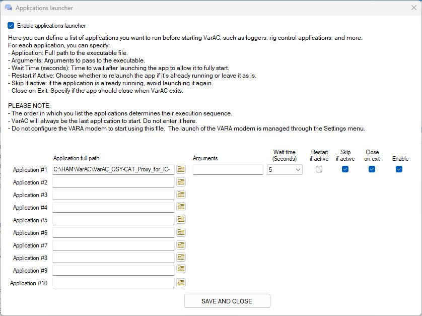
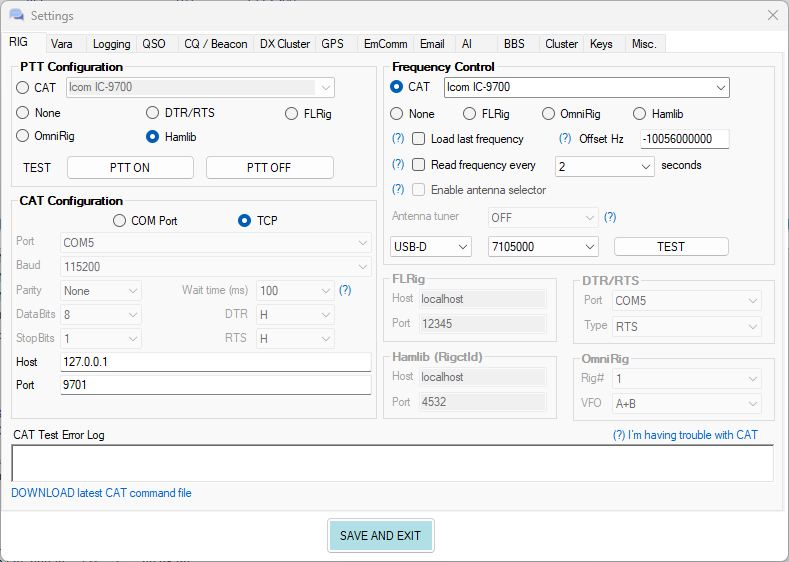

# VarAC QSY-CAT Proxy for IC-9700 by HBØTR V5.04

A Windows CAT/PTT proxy for **VarAC + VARA SAT + Icom IC-9700** in a QO-100 transverter setup. V5.04 adds an optional 10 Hz CAT transport for QO-100 RF frequencies while retaining the native SATELLITE/full-duplex and automatic D0/D1 band mapping.

**Author:** HBØTR Stefan Franz  
**QRZ:** https://www.qrz.com/db/HB0TR  
**Version:** V5.04

> This is an independent amateur-radio project. It is not affiliated with or endorsed by VarAC, Icom, Kuhne electronic, or the VARA software author.

## What's new in V5.04

The optional `VARAC_CAT_RF_10HZ=1` mode lets VarAC display and QSY at 10,489 MHz while the proxy tunes the IC-9700 at the 433 MHz RX IF and corresponding 144 MHz TX IF. Use the matching [VarAC CAT section](docs/VarAC-QO100-RF10Hz-CAT.ini) and set VarAC **Offset Hz to 0**. Its 10 Hz CAT resolution divides the 11-digit RF frequency before fitting it in Icom's five BCD bytes; the proxy restores Hz and subtracts `RX_CONVERTER_LO_HZ`.

The setting defaults to `0` for V5.03-compatible 1 Hz IF control. The new mode rejects malformed or out-of-window RF CAT commands instead of forwarding them to the IC-9700. Offline tests cover conversion, readback and safety bounds. Live operation with VarAC 15.0.18 still needs station validation.

### V5.03 CAT compatibility and shutdown retained

V5.03 is a compatibility and lifecycle release based on field feedback from a Windows 10 / VarAC 15.0.18 / IC-9700 1.50 station.

### CAT/QSY compatibility

The proxy now logs every incoming VarAC CAT frame and recognizes these Icom frequency-set forms:

- `25 00 + 5-byte BCD`
- `25 01 + 5-byte BCD`
- classic `05 + 5-byte BCD`
- CI-V send-frequency `00 + 5-byte BCD`

Recognized frequency changes inside the configured 433 MHz RX window are converted into the tested native SAT sequence that sets D0/RX and D1/TX together. Unknown CAT frames are logged before passthrough, making future VarAC rig-definition differences visible in `QSY-CAT_Proxy.log`.

Frequency readback supports `03` plus `25 00` / `25 01` query forms. In the new RF/10-Hz mode it reports the QO-100 RF in 10 Hz units; in the legacy mode it reports the SAT D0/RX IF in 1 Hz units.

### VarAC-coupled shutdown

V5.03 is intentionally hard-wired to exit after VarAC closes the CAT connection. There is no INI switch for this behavior.

On CAT disconnect the proxy:

1. closes the VarAC CAT socket;
2. sends a fail-safe native SAT `PTT OFF` (`1C 00 00`);
3. stops the proxy loop;
4. closes CAT/PTT listeners and the IC-9700 serial port;
5. allows the launcher window to close normally.

The batch launcher pauses only after an error; a normal VarAC-triggered shutdown closes without waiting for a keypress.

### Existing V5.02 SAT initialization retained

Before changing mode or frequency, the proxy still probes SAT D0/D1. If D0 is 2 m and D1 is 70 cm, it exchanges MAIN/SUB once with `07 B0`, reads both sides again, and continues only when D0 is the 70 cm RX side and D1 is the 2 m TX side.

## Data flow

```text
VarAC QO-100 downlink frequency
        |
        | RF / 10 Hz in five CAT BCD bytes
        v
QO-100 RF/10-Hz CAT units
        |
        v
+------------------------------------------------+
| VarAC QSY-CAT Proxy V5.04                     |
|                                                |
| CAT/QSY: TCP 127.0.0.1:9701                   |
| PTT:     Hamlib-compatible TCP 127.0.0.1:4532 |
|                                                |
| SAT D0 / RX = RF - converter LO (433 MHz IF)   |
| SAT D1 / TX = D0 - 289.500 MHz                 |
| PTT = native CI-V 1C 00 01 / 1C 00 00         |
+------------------------------------------------+
        |
        v
COM5 / 115200 / CI-V A2h
        |
        v
Icom IC-9700 in SATELLITE mode
        |
        +--> D0: 433 MHz downlink receive
        |
        +--> D1: 144 MHz uplink transmit
             while D0 remains active
```

## Tested full-duplex behavior

The native SAT full-duplex design used by V5.03 was validated on the HBØTR IC-9700 station with these behaviors:

- `16 5A 01` enables native SATELLITE mode.
- `07 D0` addresses the 433 MHz downlink/RX SAT side.
- `07 D1` addresses the 144 MHz uplink/TX SAT side.
- V5.03 probes D0/D1 before initialization and uses `07 B0` only when the two SAT bands are reversed.
- Both SAT sides can be set to USB-D with:
  - `06 01 01` — USB
  - `1A 06 01 02` — DATA ON / filter 2
- CI-V command `05` sets the D0 and D1 frequencies independently.
- PTT uses only `1C 00 01` / `1C 00 00`.
- During TX on 144 MHz, the 433 MHz downlink remained active and the own QO-100 downlink was audible.

## Requirements

- Windows 10 or Windows 11
- VarAC with VARA SAT
- Icom IC-9700 connected by USB and visible as a Windows COM port
- IC-9700 CI-V address `A2h`
- USB CI-V at 115200 baud
- QO-100 converter chain using approximately 433 MHz RX IF and 144 MHz TX IF
- Local TCP port `9701` for CAT/QSY
- Local TCP port `4532` for Hamlib-compatible PTT

No virtual COM-port pair is required.

## Quick start

1. Download or clone the repository.
2. Edit `proxy_config.ini` if the IC-9700 is not on `COM5`.
3. Review the converter values and `QO100_DL_RF_HZ` in `proxy_config.ini`.
4. Start `Start_VarAC_QSY-CAT_Proxy.bat`.
5. The proxy opens the radio, enables SATELLITE mode if needed, probes the D0/D1 band assignment, exchanges MAIN/SUB with `07 B0` if the 2 m / 70 cm sides are reversed, initializes both SAT sides to USB-D, optionally applies the configured startup frequencies, and verifies the resulting state.
6. Only after successful initialization are CAT port `9701` and PTT port `4532` opened.
7. Start VarAC / VARA SAT.
8. For 10 GHz RF display and QSY, configure the matching RF/10-Hz CAT section and proxy option below before enabling VarAC frequency readback.
9. For the first transmit test, use minimum safe drive power and verify the complete converter chain.

When VarAC later closes its CAT connection, V5.04 shuts itself down automatically.

## VarAC configuration

### Application Launcher

Use **VARA SAT** as the modem application.

<a href="docs/images/application-launcher.jpg"></a>

### Frequency control: QO-100 RF/10-Hz mode (recommended for 10 GHz display)

1. Append the section in [`docs/VarAC-QO100-RF10Hz-CAT.ini`](docs/VarAC-QO100-RF10Hz-CAT.ini) to the **installed** VarAC `VarAC_cat_commands.ini`. Keep its existing rig sections.
2. In `proxy_config.ini`, set `VARAC_CAT_RF_10HZ=1` and keep `RX_CONVERTER_LO_HZ=10056000000` for this converter.
3. In VarAC, select the new rig name and these settings:

```text
Frequency control: CAT
Rig:               IC-9700 QO-100 Proxy RF 10Hz
CAT connection:    TCP
Host:              127.0.0.1
Port:              9701
Mode:              USB-D
Offset Hz:         0
Read frequency:    ON, every 2 seconds
```

Enter/display the **RF** downlink frequency, for example 10,489.595 MHz. The new VarAC CAT section uses `SetFreqVfoA_hz_res=10` and `ReadFreqVfoA_Result_hz_res=10`: both directions carry 10 Hz units inside the ten-digit Icom BCD payload. The proxy performs the frequency translation:

```text
VarAC RF 10,489.595 MHz / 10 Hz = 1,048,959,500 CAT units
Proxy RX IF = 10,489.595 MHz - 10,056.000 MHz = 433.595 MHz
Proxy TX IF = 433.595 MHz - 289.500 MHz = 144.095 MHz
```

Do not enter `-10056000000` in VarAC Offset Hz for this mode. VarAC's help warns against simultaneous offset and frequency readback, and field logs showed invalid BCD QSY bytes with the legacy 10-digit/1-Hz CAT definition. The proxy's `RX_CONVERTER_LO_HZ` handles the converter LO. `QO100_DL_RF_HZ` independently defines the startup frequency before VarAC connects.

### Legacy V5.03-compatible IF/1-Hz mode

With `VARAC_CAT_RF_10HZ=0`, keep the original `Icom IC-9700` VarAC CAT section. It carries 433 MHz IF in 1 Hz units. This mode does **not** translate RF in the CAT path; VarAC must issue an actual IF frequency. The legacy VarAC Offset Hz setting at 10 GHz was not validated for reliable Slot-QSY and should not be used as a substitute for the RF/10-Hz section.

### PTT control

```text
PTT configuration: Hamlib
Host:              localhost
Port:              4532
```

The proxy accepts the Hamlib-style `T 1` / `T 0` PTT commands.

<a href="docs/images/varac-rig-control.jpg"></a>

## IC-9700 operation in V5.04

V5.04 is designed for **native SATELLITE mode**.

```text
SATELLITE mode:        ON
D0 / Downlink / RX:    433 MHz IF, USB-D
D1 / Uplink / TX:      144 MHz IF, USB-D
CI-V address:          A2h
USB CI-V baud rate:    115200
```

The proxy initializes SATELLITE mode and USB-D automatically. It opens the serial port with:

```text
Data:      8N1
Handshake: none
DTR:       HIGH
RTS:       HIGH
```

## Proxy configuration

Default `proxy_config.ini`:

```ini
LISTEN_HOST=127.0.0.1
LISTEN_PORT=9701

HAMLIB_HOST=127.0.0.1
HAMLIB_PORT=4532

RADIO_PORT=COM5
BAUD=115200
CIV_ADDRESS=A2

RX_TX_DELTA_HZ=289500000

STARTUP_SET_FREQUENCIES=1
QO100_DL_RF_HZ=10489595000
RX_CONVERTER_LO_HZ=10056000000
VARAC_CAT_RF_10HZ=0

RX_IF_MIN_HZ=433000000
RX_IF_MAX_HZ=434000000
TX_IF_MIN_HZ=144000000
TX_IF_MAX_HZ=146000000

IGNORE_VARAC_MODE_COMMANDS=1
LOG_FILE=QSY-CAT_Proxy.log
```

### Startup frequency calculation

When:

```ini
STARTUP_SET_FREQUENCIES=1
```

the proxy calculates:

```text
D0/RX IF = QO100_DL_RF_HZ - RX_CONVERTER_LO_HZ
D1/TX IF = D0/RX IF - RX_TX_DELTA_HZ
```

With the defaults:

```text
QO100_DL_RF_HZ      = 10,489.595 MHz
RX_CONVERTER_LO_HZ  = 10,056.000 MHz
D0/RX IF             =    433.595 MHz
RX_TX_DELTA_HZ       =    289.500 MHz
D1/TX IF             =    144.095 MHz
```

The RF value is stored as **integer Hz** (`10489595000`) to avoid decimal-separator ambiguity.

Set:

```ini
STARTUP_SET_FREQUENCIES=0
```

to retain the IC-9700's existing SAT frequencies at startup. Safety-window and USB-D checks still apply.

The helper `tools/Test_QO100_Startup_Frequency_Config_HB0TR.ps1` validates the INI calculation without opening the COM port or changing the radio.

## QSY sequence

For each valid VarAC QSY mapped to the configured 433 MHz RX window, V5.04 performs:

```text
07 D0       select SAT D0/RX
05 ...      set requested RX IF
07 D1       select SAT D1/TX
05 ...      set RX IF - 289.500 MHz
07 D0       return selection to D0/RX
```

The D0 and D1 frequency writes were tested independently in SATELLITE mode; setting one side did not move the other side.

### VarAC CAT commands accepted by V5.04

In legacy IF mode, V5.04 accepts the same modern and classic Icom frequency commands as V5.03. In RF/10-Hz mode, only well-formed commands mapped inside the RX safety window are accepted:

```text
25 00 <5 BCD bytes>   set VFO/frequency
25 01 <5 BCD bytes>   alternate VFO selector
05    <5 BCD bytes>   classic set-frequency
00    <5 BCD bytes>   CI-V send-frequency form
03                    read current D0/RX frequency
25 00                 read VFO/frequency
25 01                 alternate read selector
```

Every incoming CAT frame is logged with `VARAC CAT RX:`. A recognized QSY is additionally logged as `VARAC CAT SET FREQ ...` before the normal five-step SAT QSY sequence.


## PTT sequence

Native SAT full-duplex PTT is intentionally simple:

```text
PTT ON:   1C 00 01
PTT OFF:  1C 00 00
```

No `07 D0/D1` selection and no `07 B0` XCHG are used for PTT.

## USB-D initialization and VarAC mode commands

V5.04 initializes both SAT sides to USB-D using the tested classic CI-V sequence:

```text
06 01 01
1A 06 01 02
```

The proxy then verifies USB and DATA ON by readback.

Keep:

```ini
IGNORE_VARAC_MODE_COMMANDS=1
```

VarAC Icom mode command `0x26` is acknowledged locally rather than forwarded to the radio. This keeps the verified USB-D state intact and avoids relying on `0x26` in IC-9700 SATELLITE mode.

## Startup safety / fail-closed behavior

Before opening CAT/PTT listeners, V5.04 verifies:

- SATELLITE mode is ON;
- D0/D1 contain the expected 70 cm / 2 m band pair, with automatic `07 B0` correction if initially reversed;
- D0/RX is USB-D;
- D1/TX is USB-D;
- D0/RX lies inside the configured RX IF safety window;
- D1/TX lies inside the configured TX IF safety window;
- when startup frequency setting is enabled, the requested values read back exactly;
- D0/RX is checked again after D1/TX is written.

If initialization fails, CAT/PTT listeners are not started.

## Expected log output

A successful startup with the default QO-100 frequency includes lines similar to:

```text
INIT OK: SATELLITE = ON
INIT BAND MAP PROBE: D0/MAIN 433.595000 MHz | D1/SUB 144.095000 MHz
INIT BAND MAP OK: D0/MAIN is 70 cm RX and D1/SUB is 2 m TX; no exchange required.
INIT START FREQUENCIES: ON | D0/RX 433.595000 MHz | D1/TX 144.095000 MHz
INIT OK: D0/RX = USB-D
INIT OK: D0/RX = 433.595000 MHz
INIT OK: D1/TX = USB-D
INIT OK: D1/TX = 144.095000 MHz
RADIO INIT COMPLETE: SATELLITE ON | D0/RX 433.595000 MHz USB-D | D1/TX 144.095000 MHz USB-D | D0 selected.
```

A successful QSY looks similar to:

```text
SAT QSY 1/5 select D0/RX (07 D0) ... OK (FB)
SAT QSY 2/5 set D0/RX frequency (05) ... OK (FB)
SAT QSY 3/5 select D1/TX (07 D1) ... OK (FB)
SAT QSY 4/5 set D1/TX frequency (05) ... OK (FB)
SAT QSY 5/5 select D0/RX again (07 D0) ... OK (FB)
FREQ: SAT D0/RX 433.595000 MHz | SAT D1/TX 144.095000 MHz
```

A successful PTT cycle looks similar to:

```text
HAMLIB RX: T 1
PTT TX ON (1C 00 01) ... OK (FB)
PTT = TX | native SAT full-duplex active.

HAMLIB RX: T 0
PTT TX OFF (1C 00 00) ... OK (FB)
PTT = RX | D0/downlink remains the receive side.
```

## Upgrade from V5.03

V5.04 retains the V5.03 SAT band-map, full-duplex control and CAT shutdown. Existing configurations without `VARAC_CAT_RF_10HZ` continue in legacy IF/1-Hz mode. To display and QSY at 10 GHz, use the matching RF/10-Hz CAT section and set the new INI option to `1`.

Changes to be aware of:

- In RF/10-Hz mode, VarAC Offset Hz must be `0` and frequency readback should be enabled.
- The proxy validates RF/10-Hz writes against both IF safety windows and rejects unknown frequency forms.
- The launcher and configuration headers identify V5.04.

Users upgrading directly from V5.00 or V5.01 should also review the native SATELLITE-mode configuration described above.

## Safety

The proxy controls real radio hardware and can key the transmitter.

Before the first transmit test:

- reduce IC-9700 drive power to a safe level for the upconverter;
- verify the 144 MHz TX IF and converter input-power requirements;
- verify the 433 MHz downlink remains correctly mapped;
- use a dummy load or suitable test arrangement where appropriate;
- confirm PTT OFF reliably returns the transmitter to receive state;
- comply with local amateur-radio regulations and RF-safety requirements.

## Troubleshooting

See [docs/TROUBLESHOOTING.md](docs/TROUBLESHOOTING.md).

The proxy writes `QSY-CAT_Proxy.log` next to the script. This file is intentionally ignored by Git.

## Project files

```text
.
├── VarAC_QSY-CAT_Proxy_IC-9700_HB0TR.ps1
├── Start_VarAC_QSY-CAT_Proxy.bat
├── proxy_config.ini
├── README.md
├── CHANGELOG.md
├── LICENSE
├── NOTICE
├── CITATION.cff
├── CONTRIBUTING.md
├── SECURITY.md
├── tools/
│   ├── Test_QO100_Startup_Frequency_Config_HB0TR.ps1
│   └── Test_Cat_Rf10Hz_Offline.ps1
├── docs/
│   ├── ARCHITECTURE.md
│   ├── TROUBLESHOOTING.md
│   ├── VarAC-QO100-RF10Hz-CAT.ini
│   ├── LICENSE-OPTIONS.md
│   └── images/
└── .github/
```

## License

MIT License. See `LICENSE`.

## Author

**HBØTR Stefan Franz**  
https://www.qrz.com/db/HB0TR

## References

- VarAC: https://www.varac-hamradio.com/
- VarAC CAT customization guide: https://www.varac-hamradio.com/post/rig-control-cat-command-file-cat-customization-guide
- Icom IC-9700 CI-V Reference Guide: https://www.icomjapan.com/support/manual/2161/
- Icom IC-9700 product page: https://www.icomjapan.com/lineup/products/IC-9700/
- Kuhne electronic: https://www.kuhne-electronic.com/

## Disclaimer

Amateur-radio operation is subject to your local regulations and station licence. You are responsible for RF safety, frequency accuracy, drive levels, occupied bandwidth, and lawful operation. This software is supplied without warranty; test it carefully with your own station before relying on it.
